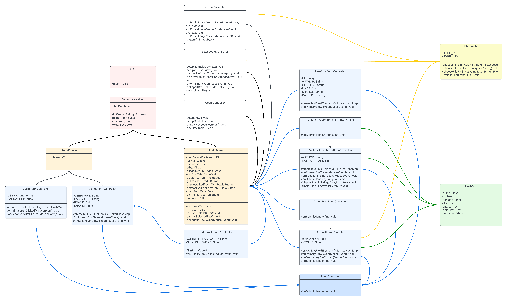

# Info

- Student name: Abdullah Alabbad
- Student ID: s3635950
- [Github repository link](https://github.com/Al3bad/data-analytics-hub)

# Notes

[Neovim](https://neovim.io) editor was mainly used to develop this program. During the development, the program was compiled and tested through the command line with java SDK. But this project was also adapted to be compiled and run using [Intellij IDEA IDE](https://www.jetbrains.com/idea/).

# Requirements

- Java SDK 20
- JavaFX 20.0.2
- SQLite JDBC 3.43.0.0
- Junit 4.13.2 (optional if you want to run the unit tests)

# Getting Started

## Download the required libraries

- Create a folder in the root directory of the project and name it `lib`
- Download [JavaFX](https://gluonhq.com/products/javafx/) and put all jar file in `lib` folder
- Download [SQLite JDBC](https://mvnrepository.com/artifact/org.xerial/sqlite-jdbc) and put the jar file in `lib` folder
- Download [Junit](https://github.com/junit-team/junit4/wiki/Download-and-Install) and put all jar file in `lib` folder (optional if you want to run the unit tests)

## Compiling & running the program

There are two ways to run the program:

### Method 1: Using Intellij IDEA IDE

1. Open the root folder in Intellij IDEA IDE: `File -> Open`.
2. In the file explorer, expand `src` then `DataAnalyticsHub` folders.
3. Right-click on `Main` class then select `More Run/Debug -> Modify Run Configurations...`
4. In the "Build and run" section, open the "Modify options" menu then select "Add VM options"
5. Add the following in the "VM options" field:

```
--module-path $ProjectFileDir$/lib --add-modules javafx.controls,javafx.fxml
```

6. Hit "Apply" then "Ok" button
7. Now run the program by hitting the run button in the top right corner of the IDE or use the hotkey `ctrl+R`.

### Method 2.1: Using a bat script (Windows systems only)

1. Open CMD.exe then navigate to the root directory of the project
2. Run `run-win.bat` script:

> NOTE: This was tested in Windows 11 running in a virtual machine

```bash
.\run-win.bat
```

### Method 2.2: Using a bash script (Unix-like systems only)

1. Open the terminal then navigate to the root directory of the project
2. Run `run.sh` script:

> NOTE: you might need to add execute flag to run the script: `chmod u+x run.sh`

```bash
./run.sh

```

# Appendix A - Admin User

The login information for the default admin user is:

- Username: `admin`
- Password: `admin`

# Appendix B - Class Diagram & App Design

> NOTE: Not all classes are included in the class diagram. This is just an abstract digram.



This app was build using MVC architecture. The model has all the main object definitions as well as the business logic. Two data access layers were implemented: `UserDao` and `PostDao`. These two objects exeucte the SQL queries to the SQLite database and return any results to the controllers.The views were built in both java and FXML. The controllers basically bridge the view and the model. So, all form submissions, event handling and validations happen in the controllers. `AppState` class is a singleton which is used as a global state for the application. It stores the logged in user, the stage object, and a method to switch scenes. The project was developed to adhere to SOLID priniciples of object-oriented programming.
